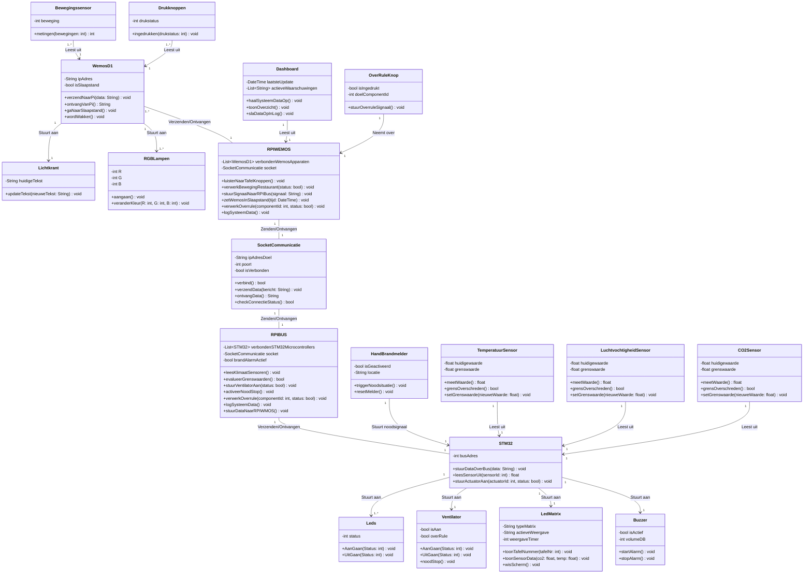

```mermaid
classDiagram
    class Lichtkrant {
        -String huidigeTekst
        +updateTekst(nieuweTekst: String) void
    }

    class Bewegingssensor {
        -int beweging
        +metingen(bewegingen: int) int
    }

    class WemosD1 {
        -String ipAdres
        -bool isSlaapstand
        +verzendNaarPi(data: String) void
        +ontvangVanPi() String
        +gaNaarSlaapstand() void
        +wordWakker() void
    }

    class RGBLampen {
        -int R
        -int G
        -int B
        +aangaan() void
        +veranderKleur(R: int, G: int, B: int) void
    }

    class Drukknoppen {
        -int drukstatus
        +ingedrukken(drukstatus: int) void
    }

    class OverRuleKnop {
        -bool isIngedrukt
        -int doelComponentId
        +stuurOverruleSignaal() void
    }

    class Dashboard {
        -DateTime laatsteUpdate
        -List~String~ actieveWaarschuwingen
        +haalSysteemDataOp() void
        +toonOverzicht() void
        +slaDataOpInLog() void
    }

    class RPIWEMOS {
        -List~WemosD1~ verbondenWemosApparaten
        -SocketCommunicatie socket
        +luisterNaarTafelKnoppen() void
        +verwerkBewegingRestaurant(status: bool) void
        +stuurSignaalNaarRPIBus(signaal: String) void
        +zetWemosInSlaapstand(tijd: DateTime) void
        +verwerkOverrule(componentId: int, status: bool) void
        +logSysteemData() void
    }

    class SocketCommunicatie {
        -String ipAdresDoel
        -int poort
        -bool isVerbonden
        +verbind() bool
        +verzendData(bericht: String) void
        +ontvangData() String
        +checkConnectieStatus() bool
    }

    class RPIBUS {
        -List~STM32~ verbondenSTM32Microcontrollers
        -SocketCommunicatie socket
        -bool brandAlarmActief
        +leesKlimaatSensoren() void
        +evalueerGrenswaarden() bool
        +stuurVentilatorAan(status: bool) void
        +activeerNoodStop() void
        +verwerkOverrule(componentId: int, status: bool) void
        +logSysteemData() void
        +stuurDataNaarRPIWMOS() void
    }

    class HandBrandmelder {
        -bool isGeactiveerd
        -String locatie
        +triggerNoodsituatie() void
        +resetMelder() void
    }

    class STM32 {
        -int busAdres
        +stuurDataOverBus(data: String) void
        +leesSensorUit(sensorId: int) float
        +stuurActuatorAan(actuatorId: int, status: bool) void
    }

    class Leds {
        -int status
        +AanGaan(Status: int) void
        +UitGaan(Status: int) void
    }

    class Ventilator {
        -bool isAan
        -bool overRule
        +AanGaan(Status: int) void
        +UitGaan(Status: int) void
        +noodStop() void
    }

    class LedMatrix {
        -String typeMatrix
        -String actieveWeergave
        -int weergaveTimer
        +toonTafelNummer(tafelNr: int) void
        +toonSensorData(co2: float, temp: float) void
        +wisScherm() void
    }

    class Buzzer {
        -bool isActief
        -int volumeDB
        +startAlarm() void
        +stopAlarm() void
    }

    class TemperatuurSensor {
        -float huidigewaarde
        -float grenswaarde
        +meetWaarde() float
        +grensOverschreden() bool
        +setGrenswaarde(nieuweWaarde: float) void
    }

    class LuchtvochtigheidSensor {
        -float huidigewaarde
        -float grenswaarde
        +meetWaarde() float
        +grensOverschreden() bool
        +setGrenswaarde(nieuweWaarde: float) void
    }

    class CO2Sensor {
        -float huidigewaarde
        -float grenswaarde
        +meetWaarde() float
        +grensOverschreden() bool
        +setGrenswaarde(nieuweWaarde: float) void
    }

    %% Relationships
    Bewegingssensor "1..*" --> "1" WemosD1 : Leest uit
    WemosD1 "1" --> "1" Lichtkrant : Stuurt aan
    WemosD1 "1" --> "1..*" RGBLampen : Stuurt aan
    Drukknoppen "1..*" --> "1" WemosD1 : Leest uit
    WemosD1 "1..*" -- "1" RPIWEMOS : Verzenden/Ontvangen
    Dashboard "1" --> "1" RPIWEMOS : Leest uit
    OverRuleKnop "1" --> "1" RPIWEMOS : Neemt over
    RPIWEMOS "1" -- "1" SocketCommunicatie : Zenden/Ontvangen
    SocketCommunicatie "1" -- "1" RPIBUS : Zenden/Ontvangen
    RPIBUS "1" -- "1" STM32 : Verzenden/Ontvangen
    HandBrandmelder "1" --> "1" STM32 : Stuurt noodsignaal
    STM32 "1" --> "1..*" Leds : Stuurt aan
    STM32 "1" --> "1" Ventilator : Stuurt aan
    STM32 "1" --> "1" LedMatrix : Stuurt aan
    STM32 "1" --> "1" Buzzer : Stuurt aan
    TemperatuurSensor "1" --> "1" STM32 : Leest uit
    LuchtvochtigheidSensor "1" --> "1" STM32 : Leest uit
    CO2Sensor "1" --> "1" STM32 : Leest uit

```
